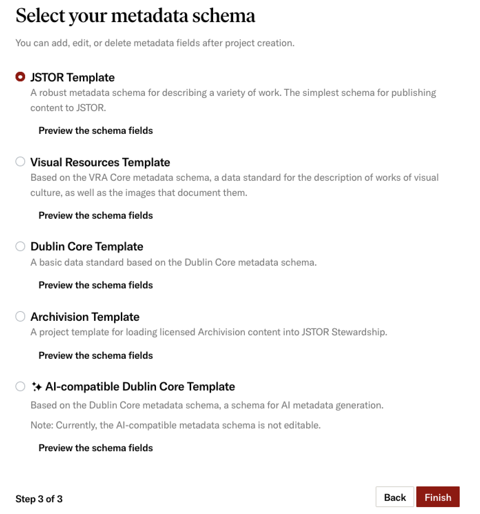
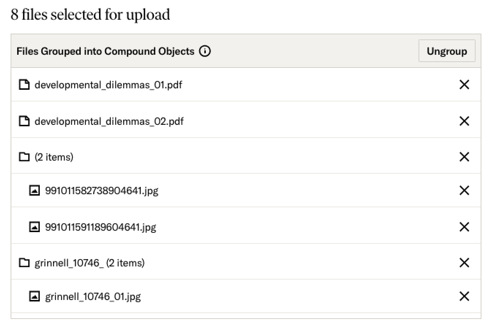
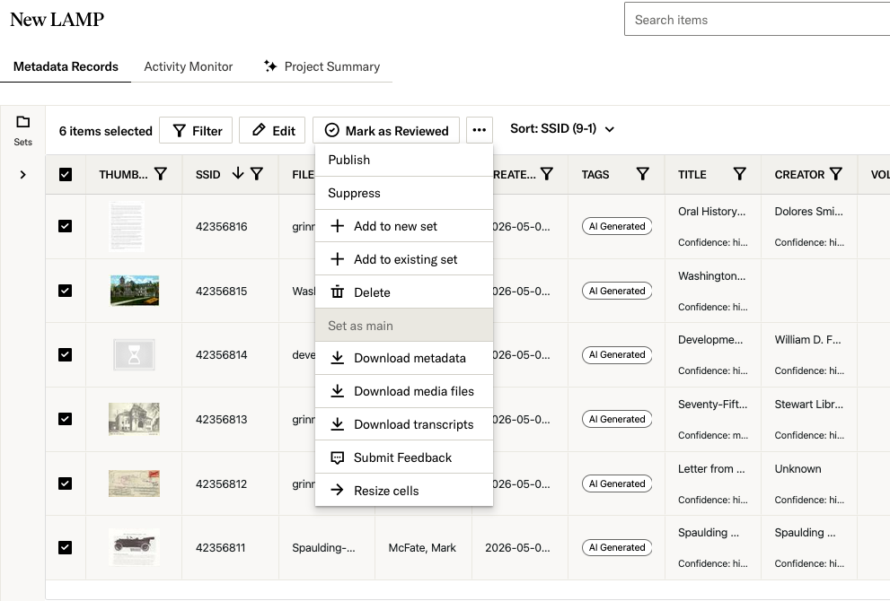
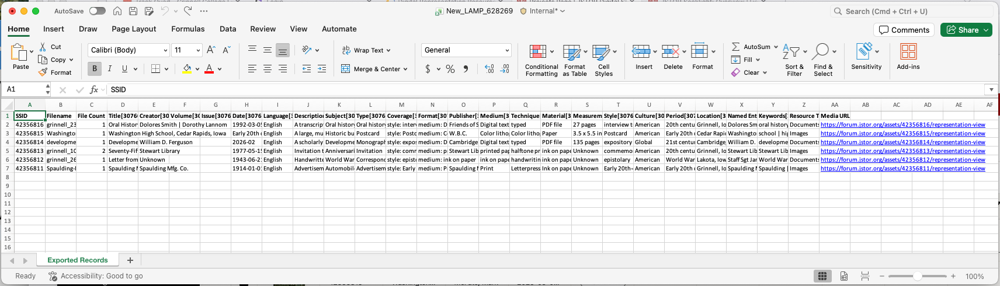
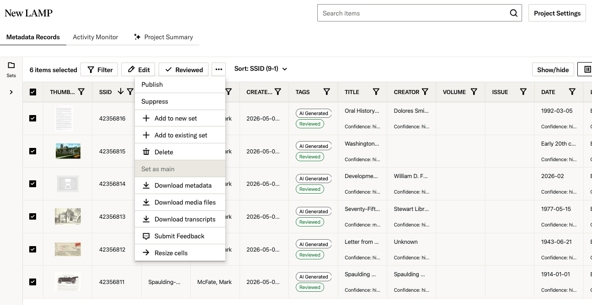

# LAMP

The Library Assets Metadata Pipeline (LAMP) is a repository, and app, that leverages Seeklight (from JSTOR) to assist with digital object metadata handling.

## Purpose

I'm creating this new repo for collection of Grinnell College specifics regarding our use of Seeklight (from JSTOR) as described in the repo title.  The repo may eventually include a Python/Flet app that I will call LAMP, as well as documentation and wisdom we gather about Seeklight.  Initially I need a place to put some sample digital objects along with their associated existing DC metadata, plus metadata to be generated by Seeklight for comparison.  One initial task will be to compare existing DC metadata with the Seeklight generated metadata to help map Seeklight fields to our established DC and DCTerms fields.

## Repository Structure

```
LAMP/
├── README.md                    # This file
├── sample-objects/              # Sample digital objects and their metadata
│   ├── _README.md               # Instructions for adding sample objects
│   ├── existing-dc-metadata/    # Existing Dublin Core (DC) metadata for sample objects
│   │   └── _README.md           # DC metadata documentation
│   └── seeklight-metadata/      # Metadata generated by Seeklight for the same objects
│       └── _README.md           # Seeklight metadata documentation
└── docs/                        # Documentation and wisdom gathered about Seeklight
    ├── field-mapping.md         # Mapping of Seeklight fields to DC and DCTerms fields
    └── using-seeklight.md       # Guide for using JSTOR Seeklight to generate metadata
```

## Goals

- Collect sample digital objects representative of Grinnell College's digital collections
- Store existing Dublin Core (DC) and DCTerms metadata for those objects
- Store Seeklight-generated metadata for the same objects
- Compare existing DC metadata with Seeklight-generated metadata
- Develop a field mapping between Seeklight fields and our established DC and DCTerms fields
- Potentially develop a Python/Flet application (LAMP) to automate metadata pipeline tasks using Seeklight

## Metadata Standards

This project works with the following metadata standards:

- **Dublin Core (DC)**: The 15 core elements defined by the Dublin Core Metadata Initiative
- **DCTerms**: The extended Dublin Core Metadata Terms vocabulary
- **Seeklight**: Metadata fields generated by JSTOR's Seeklight service

## Using Seeklight

For detailed instructions on how to access and use JSTOR Seeklight to generate metadata for digital objects, see [`docs/using-seeklight.md`](docs/using-seeklight.md).

## Sequence of Testing and Issues

### 01
On our first attempt at using Seeklight I created a new 'project' and named it "LAMP" after this repository.  Project settings include selection of a metadata schema, but recent changes in Seeklight appear to restrict generation of metadata using AI to ONLY the new "AI-compatible Dublin Core Template" as shown below.  



Consequently, the "LAMP" project was abandoned and left empty.  

### 02 
A new project named "LAMP-AI" was created and the ""AI-compatible Dublin Core Template" was selected for it.  Experience with that project generated an initial set of data in this project's `main` branch.  

### 03
A new `new_analysis` branch of this project was created and we attempted to engage Seeklight's "compound" object behavior with NO initial project creation.  An issue with compound file naming came to light as illustrated below.  

 

The above image shows our attempt to restructure content filenames for two objects to reflect the "compound" nature of them.  

a) The first titled "Developmental Dilemmas" consists of two PDF files representing a book in PDF form, and a digital-only set of appendicies to the book, also in PDF form.  

As you can see, **Seeklight's "compound" grouping does not appear to apply to PDF file types**.  

_Since this limitation cannot be overcome by simple file naming, the two PDF files were merged into a single PDF that will be submitted to Seeklight for processing._  

b) Two unrelated image files, "sample-objects/objects/Spaulding H advertisement/991011591189604641.jpg" and "sample-objects/objects/Washington High School, Cedar Rapids, Iowa/991011582738904641.jpg" were errantly grouped as a single "compound" apparently because the grouping algorithm found similar numbers (all of Grinnell's Alma MMS_ID values end in "04641") and paired them together. 

Clearly, **we will have to use different names for objects from Alma to trigger proper "compound" file grouping**. 

_Changes to the filenames were made to keep them from errantly grouping as a "compound", and you can see the results in the image below._   

c) The second compound object titled "Stewart Public Library, Grinnell, Iowa" consisted of recto and verso images.  This object appears to have been "grouped" properly as a compound object with similar, but sequentially numbered, filenames.  No further action is needed for this compound object.  

### 04
Files were renamed to avoid errant "compound" grouping and the "New LAMP" project configuration selected "AI-compatible Dublin Core Template" for its metadata schema.  Metadata generation was subsequently engaged to create 6 metadata records.  



A portion of the results and the `...` menu options for the initial records (not yet marked as "Reviewed") appear as in the image above.  

### 05
Selecting all 6 records and choosing "Download metadata" produced the XLSX file you see captured below, and there was no option to export the metadata in any other format.  

 
 
Since the XLSX image is difficult to see we have attached it to the repository as `New_LAMP_628269.xlsx`.  

The file has 23 fields of descriptive metadata with some fields like `VOLUME` and `ISSUE` left entirely blank.  The XLSX data doesn't appear to include any of the "confidence" data that is displayed in the metadata within the JSTOR interface.  

### 06
I again selected all 6 records and marked the metadata as having been reviewed.  The screen and `...` menu choices you see then changed to this:  



### 07
Selecting all 6 records and choosing "Download metadata" again produced the repo XLSX file `New_LAMP_638202.xlsx`, **again with no options for other formats or behavior**. 

The two XLSX exports were converted to CSV files (they are in the repo) and compared, and proven to be IDENTICAL.  So marking the metadata as reviewed had no apparent effect on the metdata or the apps export behavior.  

### 08
To preserve past analysis I renamed the "seeklight-metadata" folder to "seeklight-metadata-Rev-0".  I've created a new "seeklight-metadata-Rev-1" folder for Seeklight exports from this latest analysis and moved four files, two .xlsx and two .csv, to that new folder.  

I also renamed the "mapped-metadata" folder to "mapped-metadata-Rev-0", created a new copy of that folder named "mapped-metadata-Rev-1", and am populating it with new 

### 09
I was curious about the `[bracketed]` numbers following field names in the Seeklight exports.  Copilot found this:  

Let me check if there's any documentation about these bracketed numbers:  

Read [](file:///Users/mcfatem/GitHub/LAMP/sample-objects/seeklight-metadata-Rev-1/README.md)

Read [](file:///Users/mcfatem/GitHub/LAMP/sample-objects/seeklight-metadata-Rev-0/README.md)

Let me search for any documentation that might explain this: 

Searched for regex `3076089|3076090|bracketed|field.*ID|custom field` (`**/*.md`), 16 results

Read [](file:///Users/mcfatem/GitHub/LAMP/docs/field-mapping.md#1-1), lines 1 to 100

Read [](file:///Users/mcfatem/GitHub/LAMP/docs/field-mapping.md#100-100), lines 100 to 118

Based on the patterns in your files and documentation, the **bracketed numbers are custom field identifiers** in JSTOR Forum's system (which Seeklight uses for metadata exports).

Here's what I can tell you:

```
## Key Points:

1. **Sequential IDs**: They're sequential database field IDs that increment by 1 for each field
   - Example: Title[3076089], Creator[3076090], Volume[3076091], etc.

2. **System-Specific**: The high starting number (3076089) suggests these are system-wide identifiers in JSTOR Forum's database, not just local to your export

3. **Version Changes**: These IDs change between exports/configurations:
   - **Older export** (LAMP_AI_624375.csv): Title[3071073], Creator[3071074], Style[3071089]
   - **Newer export** (New_LAMP_628302.csv): Title[3076089], Creator[3076090], Style[3076105]

4. **For Mapping Purposes**: The field **names** (Title, Creator, Description, etc.) are what matter for your DC/DCTerms mapping—the bracketed numbers can be ignored when doing metadata transformations

5. **Likely Purpose**: These IDs probably allow JSTOR Forum to:
   - Track custom field definitions across different projects/workspaces
   - Maintain configuration settings
   - Reference fields in their internal database

For your mapping work, you can treat these as administrative metadata that helps JSTOR Forum manage its field configurations, but they don't affect how you map the content to Dublin Core fields.
```

### 10
Did a little research regarding the `[bracketed]` numbers in the Seeklight headings and found this:  

```
Let me check if there's any documentation about these bracketed numbers:  

Read [](file:///Users/mcfatem/GitHub/LAMP/sample-objects/seeklight-metadata-Rev-1/README.md)

Read [](file:///Users/mcfatem/GitHub/LAMP/sample-objects/seeklight-metadata-Rev-0/README.md)

Let me search for any documentation that might explain this: 

Searched for regex `3076089|3076090|bracketed|field.*ID|custom field` (`**/*.md`), 16 results

Read [](file:///Users/mcfatem/GitHub/LAMP/docs/field-mapping.md#1-1), lines 1 to 100

Read [](file:///Users/mcfatem/GitHub/LAMP/docs/field-mapping.md#100-100), lines 100 to 118

Based on the patterns in your files and documentation, the **bracketed numbers are custom field identifiers** in JSTOR Forum's system (which Seeklight uses for metadata exports).

Here's what I can tell you:

## Key Points:

1. **Sequential IDs**: They're sequential database field IDs that increment by 1 for each field
   - Example: Title[3076089], Creator[3076090], Volume[3076091], etc.

2. **System-Specific**: The high starting number (3076089) suggests these are system-wide identifiers in JSTOR Forum's database, not just local to your export

3. **Version Changes**: These IDs change between exports/configurations:
   - **Older export** (LAMP_AI_624375.csv): Title[3071073], Creator[3071074], Style[3071089]
   - **Newer export** (New_LAMP_628302.csv): Title[3076089], Creator[3076090], Style[3076105]

4. **For Mapping Purposes**: The field **names** (Title, Creator, Description, etc.) are what matter for your DC/DCTerms mapping—the bracketed numbers can be ignored when doing metadata transformations

5. **Likely Purpose**: These IDs probably allow JSTOR Forum to:
   - Track custom field definitions across different projects/workspaces
   - Maintain configuration settings
   - Reference fields in their internal database

For your mapping work, you can treat these as administrative metadata that helps JSTOR Forum manage its field configurations, but they don't affect how you map the content to Dublin Core fields.
```

I subsequently "softened" the logic in /Users/mcfatem/GitHub/LAMP/sample-objects/mapped-metadata-Rev-1/map_seeklight_to_dcap01.py to ignore those numbers, ran the script again, and confirmed that the new results are IDENTICAL to the old output, and that output (in /Users/mcfatem/GitHub/LAMP/sample-objects/mapped-metadata-Rev-1/seeklight_export_to_DCAP01-FROM-SCRIPT.csv) remains IDENTICAL to the raw Copilot output in /Users/mcfatem/GitHub/LAMP/sample-objects/mapped-metadata-Rev-1/seeklight_export_to_DCAP01-FROM-COPILOT.csv.  

### 11
Now, time to modify and run the /Users/mcfatem/GitHub/LAMP/sample-objects/mapped-metadata-Rev-1/compare_metadata.py and sample-objects/mapped-metadata-Rev-1/compare_similar_values.py scripts again using this new output.  

